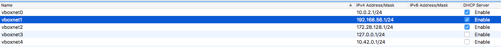

# weblogic_rpm

# TODO
- opatch automation

# Setup 

|Software|Version|
|---|---|
|VirtualBox | Version 5.2.6 r120293 (Qt5.6.3)
|Vagrant    | Vagrant 2.0.2 
|Gradle     | Gradle 4.2.1 
|Groovy:    | 2.4.12 
|Ant:       | Apache Ant(TM) version 1.9.6 compiled on June 29 2015
|JVM:       | 1.8.0_144 (Oracle Corporation 25.144-b01)
|OS:        | Mac OS X 10.12.6 x86_64
|IntelliJ|Build #IU-173.4548.28, built on January 29, 2018


## VirtualBox
Version 5.2.6 r120293 (Qt5.6.3)

Enable DHCP on virtualbox private network


Enable DHCP on the private network

## Vagrant


## Intelij (TODO)
Open 

## Add binaries to project (TODO: Create a script to download) 
Add fmw_*_wls.jar files to files/
Add jdk-*-linux-x64.rpm to files/ 

# Generate Run Scripts (TODO: Write the scripts to file)
```bash
python create.py
```

# Run
```bash
STLC02NL0W6G3QP:weblogic_rpm kdooley$cat centos7_12.1.3.0.0.sh 
#!/usr/bin/env bash
gradle :run:os:install -Pos=centos7 -Pwls=12.1.3.0.0 &&
gradle :run:weblogic:install -Pos=centos7 -Pwls=12.1.3.0.0 &&
gradle :run:rpm:create -Pos=centos7 -Pwls=12.1.3.0.0 &&
gradle :run:os:halt -Pos=centos7 -Pwls=12.1.3.0.0 &&
gradle :run:rpm:install -Pos=centos7 -Pwls=12.1.3.0.0

STLC02NL0W6G3QP:weblogic_rpm kdooley$ time centos7_12.1.3.0.0.sh 
...
real    9m14.413s
user    0m7.839s
sys     0m1.330s
```

What|Where
---|---
Vagrant | build/$OS/$WLS/
RPM|build/$OS/$WLS/fmw-*.rpm|


# USAGE
```bash
# Create CentOS6 and Weblogic 12.2.1.3.0
./weblogic_rpm.py create --os=centos6 --wls=12.2.1.3.0
./weblogic_rpm.py install --os=centos6 --wls=12.2.1.3.0

# Create CentOS7 and Weblogic 12.1.3.0.0
./weblogic_rpm.py create --os=centos6 --wls=12.1.3.0.0
./weblogic_rpm.py install --os=centos6 --wls=12.1.3.0.0

```

# Gradle commands sample

```bash
# Install OS
gradle :run:os:install -Pos=centos6 -Pwls=12.1.3.0.0 
gradle :run:os:test:install -Pos=centos6 -Pwls=12.1.3.0.0 

# Install Weblogic
gradle :run:weblogic:install -Pos=centos6 -Pwls=12.1.3.0.0
gradle :run:weblogic:test:install -Pos=centos6 -Pwls=12.1.3.0.0

# Create RPM
gradle :run:rpm:create -Pos=centos7 -Pwls=12.1.3.0.0
gradle :run:rpm:test:create -Pos=centos7 -Pwls=12.1.3.0.0

# Stop VM
gradle :run:os:halt -Pos=centos7 -Pwls=12.1.3.0.0

# Install RPM 
gradle :run:rpm:install -Pos=centos7 -Pwls=12.1.3.0.0
gradle :run:rpm:test:install -Pos=centos7 -Pwls=12.1.3.0.0
gradle :run:rpm:halt -Pos=centos7 -Pwls=12.1.3.0.0 
```

# Install multiple packages

```bash
Update /etc/yum.conf
installonlypkgs=fmw

yum install /vagrant/fmw-12.2.1.2.0-1.x86_64.rpm 

[root@weblogic-centos6-12 ~]# ls -l /opt/oracle/product/
total 8
drwxr-xr-x. 11 oracle oinstall 4096 Mar 28 01:01 fmw-12.2.1.2.0
drwxr-xr-x. 10 oracle oinstall 4096 Mar 28 00:49 fmw-12.2.1.3.0
```

